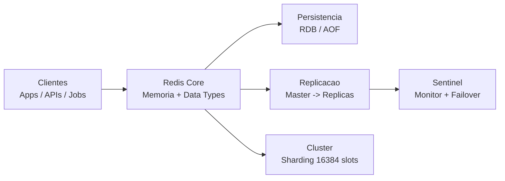

# Diagrama em Mermaid — Arquitetura Redis (Exemplo)

Use este diagrama para visualizar a arquitetura básica do Redis com persistência, replicação, Sentinel e Cluster.

## Observações

- O fluxo destaca o Redis Core como ponto central.
- A persistência garante recuperação em reinícios.
- Replicação e Sentinel cuidam de alta disponibilidade.
- Cluster entrega escala horizontal.
